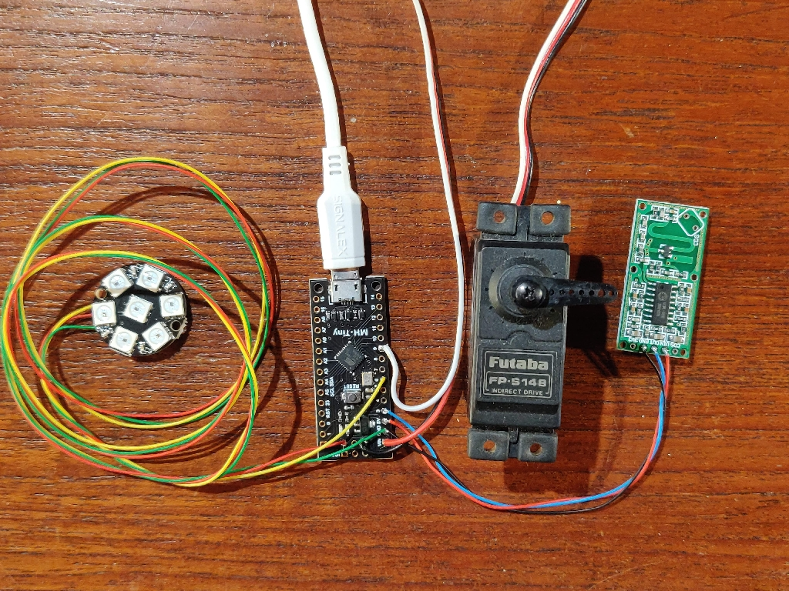

# HalloweenShow
Arduino project to drive servo and neopixels using MH-Tiny board

## RCWL-0516 microwave radar sensor

[rcwl-0516](./Documents/Datasheet_rcwl-0516.pdf)

## MH-Tiny board

[Arduino Tiny 88](./Documents/Arduino_Tiny_88.pdf)

## Arduino Sketch

[milo_servo](./milo_servo/milo_servo.ino)

## YouTube video

[Video](https://youtu.be/_YrXmuSzj3Y)
